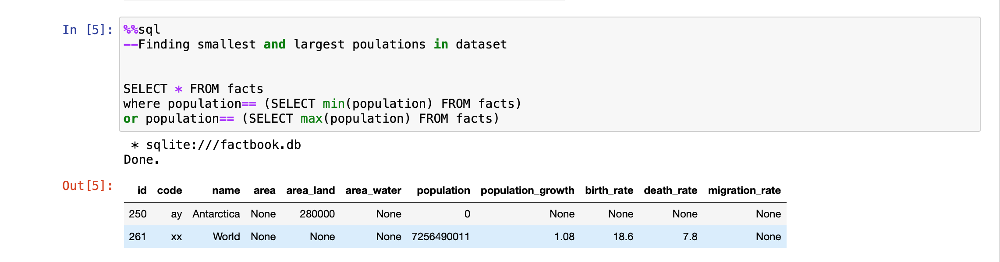

# Analyzing-CIA-Factbook-Data-Using-SQL
Repository for analysis of CIA Factbook Data.

### Using SQL queries to do a basic analysis of CIA data.

## Questions:
1. Which countries have the largest/smallest populations?
2. Which countries have the largest population growth rate?
3. Which countries have the highest ratios of water to land? Which countries have more water than land?
Which countries will add the most people to their populations next year?
4. Which countries have a higher death rate than birth rate?
5. Which countries have the highest population/area ratio, and how does it compare to list we found in the previous screen?

## Database used:
[factbook.db](https://github.com/ns102030/Analyzing-CIA-Factbook-Data-Using-SQL/blob/main/Analyzing%20CIA%20Factbook%20Data%20Using%20SQL/factbook.db)

